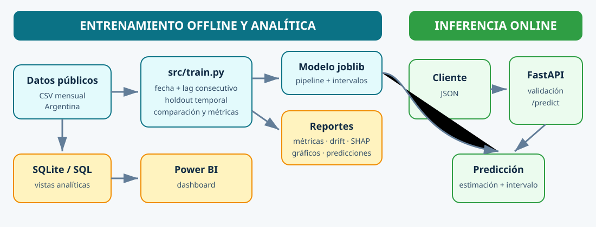

# 🛢️ Oil Production Analytics & Machine Learning

End-to-end **Data Analytics and Machine Learning project** focused on analyzing and predicting monthly oil production using public hydrocarbon production data from Argentina.

The project covers the complete workflow from exploratory data analysis and feature engineering to temporal validation, model evaluation, serialization, and deployment through a REST API.

---

## 📌 Project Overview

The objective of this project is to analyze historical oil well production data and build a Machine Learning model capable of estimating monthly oil production.

The original dataset contains approximately **1 million production records** with information about wells, production, injection, extraction methods, geographic location, and operational characteristics.

The project includes:

- Exploratory Data Analysis (EDA)
- Data cleaning and profiling
- Data visualization
- Feature selection
- Categorical encoding
- Feature engineering
- Lag features
- Machine Learning regression
- Baseline comparison
- Temporal validation
- Error analysis
- Feature importance analysis
- Model serialization
- REST API with FastAPI

---

## 📊 Data Analytics

The exploratory analysis was performed using **Pandas, NumPy and Matplotlib**.

Some of the analyses include:

- Oil production by province
- Monthly production evolution
- Production distribution
- Missing value analysis
- Duplicate detection
- Well-level analysis
- Production statistics
- Operational and geographical characteristics

The original dataset contains:

- **~991,000 records**
- **38 variables**
- **83,000+ well identifiers**
- Multiple producing provinces and hydrocarbon basins

The analysis showed a strong concentration of oil production in provinces such as **Neuquén, Chubut and Santa Cruz**.

---

## 🤖 Machine Learning

The target variable is:

```text
prod_pet
```

which represents monthly oil production.

The initial model used operational, geographical and well characteristics such as:

```text
mes
iny_agua
iny_gas
tef
tipoextraccion
tipoestado
tipopozo
provincia
cuenca
```

Categorical variables are transformed using:

```text
OneHotEncoder
```

The preprocessing and model are combined using a **scikit-learn Pipeline** and `ColumnTransformer`.

---

## 🧠 Feature Engineering

Exploratory modeling showed that static and operational characteristics alone were not sufficient to accurately represent the temporal behavior of individual wells.

A historical feature was therefore introduced:

```text
prod_pet_lag1
```

This represents the oil production of the same well during the **previous month**.

Example:

| Month | Production | Previous Month Production |
|---:|---:|---:|
| 1 | 100 | N/A |
| 2 | 95 | 100 |
| 3 | 91 | 95 |
| 4 | 87 | 91 |

This feature significantly improved predictive performance.

`idpozo` is used to construct the historical feature but is **not used directly as a numerical model feature**.

---

## ⏱️ Temporal Validation

Instead of a random split, the reproducible training script builds a complete
date from `anio` and `mes`, orders observations by well and date, and reserves
the final three observed calendar months as a **future temporal holdout**.

```text
All dates before the cutoff → Training
Final 3 calendar months     → Testing
```

This prevents records from a later year entering training merely because their
calendar month is between January and September. A lag is retained only when
the previous observation for that well is exactly one calendar month earlier.

The final model represents a **one-step-ahead prediction scenario**, meaning that the previous month's actual production is available when predicting the following month.

---

## 🌲 Model

The original notebook model is a:

**Random Forest Regressor**

Main configuration:

```python
RandomForestRegressor(
    n_estimators=150,
    max_depth=15,
    min_samples_leaf=2,
    random_state=42,
    n_jobs=-1
)
```

---

## 📈 Model Performance

### Model without production history

| Metric | Result |
|---|---:|
| MAE | 142.71 |
| RMSE | 470.91 |
| R² | 0.4549 |

### Final model with `prod_pet_lag1`

| Metric | Result |
|---|---:|
| **MAE** | **44.46** |
| **RMSE** | **241.10** |
| **R²** | **0.8562** |

Adding historical production substantially improved model performance.

### Performance by test month

| Month | MAE | RMSE | R² |
|---:|---:|---:|---:|
| 10 | 43.76 | 250.50 | 0.85 |
| 11 | 43.69 | 224.61 | 0.86 |
| 12 | 45.93 | 247.29 | 0.86 |

Performance remained relatively stable across all three future test months.

> These published figures are the original notebook result. Running
> `python -m src.train` regenerates the evaluation using the stricter complete-
> date split and saves the new source-of-truth metrics in `reports/metrics.json`.

---

## 📉 Baseline Comparison

A `DummyRegressor` was used as a baseline to verify that the Machine Learning model was learning meaningful patterns.

The Random Forest substantially outperformed the baseline across MAE, RMSE and R².

This comparison helps ensure that the predictive model provides value beyond simply predicting the average production.

---

## 🔍 Model Interpretation

Feature importance analysis was performed to understand which variables contributed most to the predictions.

Important features included:

- Previous month's oil production
- Effective production time (`tef`)
- Well type
- Extraction method
- Province
- Basin
- Month

The analysis also showed that models without historical production tended to underestimate wells with exceptionally high production.

---

## 🏗️ Project Architecture



El entrenamiento y la evaluación son procesos **offline**. La API es un
proceso **online** separado que solamente carga el artefacto y sirve
predicciones; nunca reentrena durante una petición.

```text
oil-production-analytics-ml/
│
├── data/                         # local; datos grandes no versionados
├── docs/                         # arquitectura en formato SVG de texto
├── models/                       # artefactos locales de entrenamiento
├── notebooks/
│   ├── 01_exploracion.ipynb
│   └── 02_modelo.ipynb
├── powerbi/
│   └── ypf_production_dashboard.pbix
├── reports/                      # métricas y gráficos generados
├── sql/
│   ├── analytics_queries.sql
│   ├── schema.sql
│   └── views.sql
├── src/
│   ├── load_sqlite.py
│   ├── main.py                   # inferencia online
│   └── train.py                  # entrenamiento offline
├── tests/
├── .gitignore
├── README.md
└── requirements.txt
```

> The original dataset and serialized model are excluded from Git because of their size.

---

## 🛠️ Tech Stack

### Data Analytics

- Python
- Pandas
- NumPy
- Matplotlib
- Jupyter Notebook

### Machine Learning

- scikit-learn
- Random Forest
- OneHotEncoder
- ColumnTransformer
- Pipeline
- Joblib

### Backend / Model Serving

- FastAPI
- Pydantic
- Uvicorn

### Development

- VS Code
- Git
- GitHub
- Python Virtual Environments

---

## 🚀 Running the Project

### 1. Clone the repository

```bash
git clone <repository-url>
cd oil-production-analytics-ml
```

### 2. Create a virtual environment

```bash
python -m venv venv
```

### 3. Activate it

Windows:

```bash
venv\Scripts\activate
```

Linux/macOS:

```bash
source venv/bin/activate
```

### 4. Install dependencies

```bash
pip install -r requirements.txt
```

### 5. Download and train

Download the official CSV linked in [Data Source](#-data-source), save it
exactly as `data/produccion.csv`, and run:

```bash
python -m src.train
```

The command creates the deployable bundle in `models/` and writes auditable
metrics, holdout predictions and plots in `reports/`. Optional XGBoost and SHAP
support is installed and activated explicitly:

```bash
pip install "xgboost>=3,<4" "shap>=0.46,<1"
python -m src.train --include-xgboost --with-shap
```

To build the analytical SQLite database and its Power BI views:

```bash
python -m src.load_sqlite
```

---

## 🌐 REST API

The trained Machine Learning pipeline is exposed through a **FastAPI REST API**.

Start the server:

```bash
uvicorn src.main:app --reload
```

The API will be available at:

```text
http://127.0.0.1:8000
```

Interactive Swagger documentation:

```text
http://127.0.0.1:8000/docs
```

---

## 🔌 Endpoints

### Health Check

```http
GET /health
```

Response:

```json
{
  "status": "ok",
  "model_loaded": true
}
```

### Oil Production Prediction

```http
POST /predict
```

Example request:

```json
{
  "mes": 10,
  "iny_agua": 0,
  "iny_gas": 0,
  "tef": 31,
  "tipoextraccion": "Bombeo Mecánico",
  "tipoestado": "Extracción Efectiva",
  "tipopozo": "Petrolífero",
  "provincia": "Santa Cruz",
  "cuenca": "GOLFO SAN JORGE",
  "prod_pet_lag1": 52.86
}
```

Example response:

```json
{
  "produccion_predicha": 54.91,
  "intervalo_prediccion_90": {
    "inferior": 48.21,
    "superior": 61.84
  }
}
```

The optional interval is derived from the 5% and 95% residual quantiles in the
temporal holdout. It communicates empirical uncertainty, but is not a formal
conditional-coverage guarantee.

---

## 🔄 Machine Learning Workflow

```text
Public Hydrocarbon Data
          ↓
     Data Loading
          ↓
        EDA
          ↓
    Data Cleaning
          ↓
  Feature Engineering
          ↓
     Lag Features
          ↓
 Temporal Train/Test Split
          ↓
    Preprocessing
          ↓
   Random Forest
          ↓
 Model Evaluation
          ↓
 Model Serialization
          ↓
      FastAPI
          ↓
    POST /predict
```

---

## 🎯 Key Results

- Analyzed approximately **1 million hydrocarbon production records**
- Built an end-to-end Data Analytics and Machine Learning workflow
- Implemented temporal validation instead of relying only on random splitting
- Engineered historical well-production features
- Improved R² from approximately **0.45 to 0.86**
- Reduced MAE from approximately **142.7 to 44.5**
- Evaluated performance independently across future months
- Serialized the complete ML pipeline
- Exposed predictions through a REST API
- Documented limitations and prediction assumptions

---

## 🧭 Technical Decisions

- **Offline training vs. online inference:** `src/train.py` owns data loading,
  feature engineering, evaluation and serialization. `src/main.py` only
  validates a request and invokes the serialized pipeline.
- **Complete temporal key:** `anio` and `mes` become a first-of-month timestamp.
  Sorting or splitting on `mes` alone is explicitly avoided.
- **Consecutive lag:** `prod_pet_lag1` is created per `idpozo` only when the
  preceding record is exactly one month earlier; gaps are not silently treated
  as the previous month.
- **Model comparison:** every run evaluates persistence
  (`prediction = prod_pet_lag1`), mean, Random Forest and
  HistGradientBoosting under the same holdout. XGBoost is an optional comparison
  via `--include-xgboost` to avoid making it a mandatory runtime dependency.
- **Selection:** the deployable trainable candidate with the lowest holdout MAE
  is serialized. Persistence remains a required business baseline in the report.
- **Segmented error:** the JSON report includes metrics by province, basin,
  production range, and new versus previously observed wells.
- **Uncertainty:** the artifact stores empirical 5%/95% holdout residual
  quantiles and the API returns the resulting 90% diagnostic interval.
- **Explainability:** `--with-shap` exports mean absolute SHAP importance when
  the optional package is installed.
- **Drift:** numeric PSI and categorical total-variation distance compare the
  training and holdout populations. These are monitoring signals, not automatic
  proof of model degradation.
- **Operational assumption:** current-month injection and operating-time inputs
  must be known or estimated at request time. For a true beginning-of-month
  forecast, they should be replaced with lagged or planned values.

## 📊 Generated Visuals

To keep the Git history and pull request fully text-compatible, generated PNG
plots are not committed. The offline script creates the real-vs-predicted and
monthly-holdout charts locally in `reports/` on every training run; that folder
is ignored by Git.

---

## ⚠️ Limitations

The final model uses the previous month's actual production (`prod_pet_lag1`) to estimate the following month's production.

Therefore, the reported performance corresponds to a **one-step-ahead forecasting scenario** rather than a recursive multi-month forecast where future lag values would also need to be predicted.

Extremely high-production wells may also present greater prediction errors due to their lower frequency and higher variance.

---

## 🔮 Future Improvements

Possible extensions include:

- LightGBM comparison
- Hyperparameter optimization
- TimeSeriesSplit
- Additional lag features (`lag2`, `lag3`)
- Rolling production averages
- MLflow experiment tracking
- Docker
- GitHub Actions continuous integration
- Calibrated conformal prediction intervals
- Automated production drift alerts
- Cloud deployment
- Automated retraining pipeline

---
## 📊 Data Source

This project uses official public hydrocarbon production data published by the
Argentine Government.

- **Dataset:** Producción de petróleo y gas por pozo (Capítulo IV)
- **Publisher:** Secretaría de Energía de la República Argentina
- **Source:** Datos Argentina
- **Granularity:** Monthly production by well, field, concession and province
- **Update frequency:** Monthly
- **Oil production (`prod_pet`):** m³
- **Gas production (`prod_gas`):** thousands of m³
- **Water production (`prod_agua`):** m³

Official dataset:

https://datos.gob.ar/ar/dataset/energia-produccion-petroleo-gas-por-pozo-capitulo-iv

The raw dataset is not included in this repository due to its size.

### Main variables used by the ML model

| Variable | Description |
|---|---|
| `mes` | Calendar month (1–12) |
| `iny_agua` | Water injection |
| `iny_gas` | Gas injection |
| `tef` | Effective operating time of the well |
| `tipoextraccion` | Extraction method |
| `tipoestado` | Operational status |
| `tipopozo` | Well type |
| `provincia` | Argentine province |
| `cuenca` | Hydrocarbon basin |
| `prod_pet_lag1` | Oil production from the previous monthly period |
| `prod_pet` | Target variable: monthly oil production (m³) |

### Reproducibility

1. Download the dataset from the official source above.
2. Save the CSV as:

   `data/produccion.csv`

3. Install the project dependencies.
4. Run the preprocessing/training pipeline described in this repository.

### Dataset License

The source code of this repository is licensed under the MIT License.

The dataset is provided by the Argentine Government and is not covered by
this repository's MIT License. Usage of the dataset is subject to the terms
of its original publisher.

## 👤 Author

**Franco Martín Sassi**

Software Engineer focused on Backend, Data, Machine Learning and AI Engineering.
