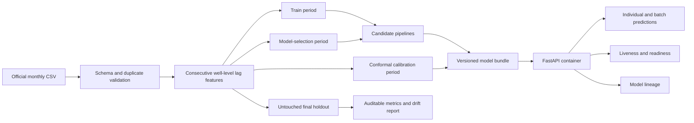

# Production-oriented architecture

The training process is offline and the API never retrains during a request.
The container receives the model as a read-only mounted artifact. A future
production deployment can replace that mount with a versioned artifact store
without changing the prediction contract.
